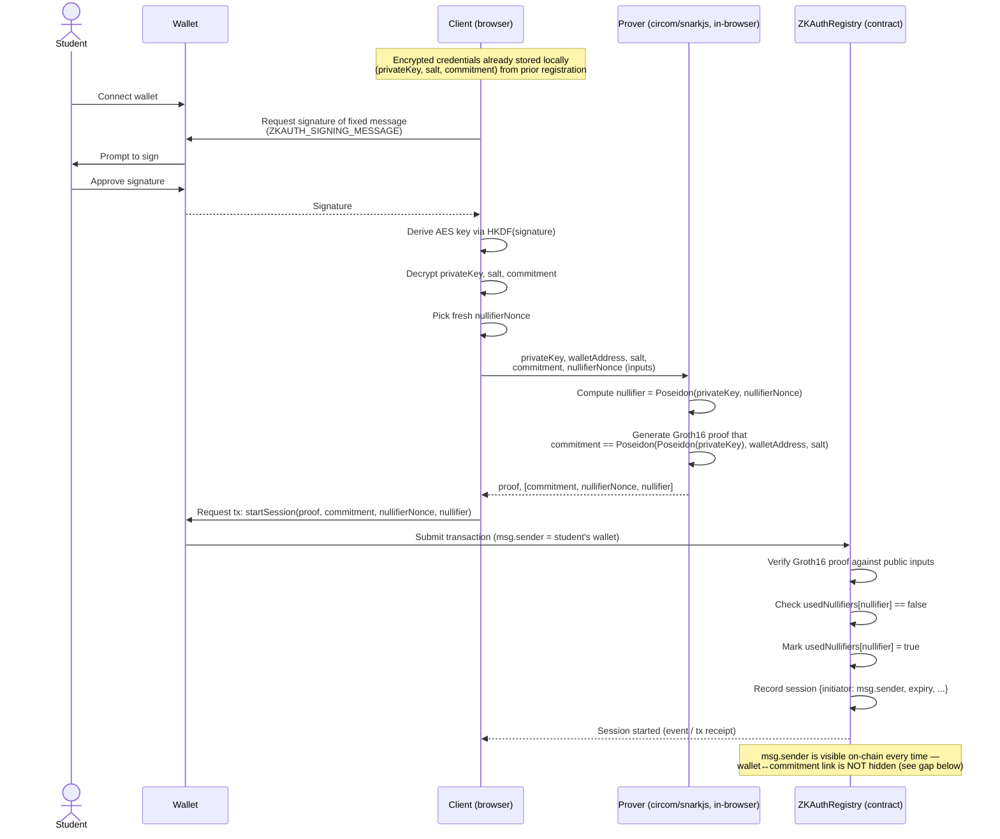

# Thesis Defense Q&A Notes: ZK Private Login

Working notes for compiling the thesis presentation for the examining committee.
Source: analysis of `frontend/src/hooks/useZKAuth.ts` and `contracts/contracts/ZKAuthRegistry.sol`.

## Q: How is zero-knowledge proof and private login achieved for a student, given the wallet must be reconnected on every private login attempt?

The wallet connects each time only to sign a fixed message locally, which derives an AES key that decrypts the student's stored secret credentials (a `privateKey`, `salt`, and `commitment`) — the wallet itself is not what gets verified on-chain, it's just the local unlock mechanism (`useZKAuth.ts:63-358`).

Using those decrypted secrets, the frontend generates a Groth16 zk-SNARK proof (via a circom circuit) that proves knowledge of a `privateKey` matching a previously registered `commitment = Poseidon(Poseidon(privateKey), walletAddress, salt)`, plus a fresh session `nullifier = Poseidon(privateKey, nullifierNonce)` — so the student proves "I own this registered identity" without revealing the private key itself, and each login uses a new nullifier to prevent replaying an old proof.

The `ZKAuthRegistry.sol` contract verifies the proof against the public `commitment`/`nullifier` and marks the nullifier spent, but note it's not fully wallet-anonymous: `startSession` is still sent as a transaction from the connected wallet, so `msg.sender` links wallet-to-commitment on every login even though the private key never leaves the client (acknowledged as a residual privacy gap in the contract's own comments, `ZKAuthRegistry.sol:38-43`).

## Diagram: private login flow

**Reading the diagram:** the wallet's only two jobs are (1) sign a fixed message so the client can decrypt locally-stored secrets, and (2) submit the resulting proof as a transaction. The private key never leaves the client; the contract only ever sees `commitment`, `nullifierNonce`, `nullifier`, and the proof — plus, unavoidably today, `msg.sender`.

## Q: How does it protect against msg.sender linking each login?

It doesn't. This is an explicitly documented, unmitigated gap, not something the design defends against.

`startSession` is a plain `external` call — no ERC-2771/relayer/meta-tx path — so `msg.sender` is always the connected wallet, and the frontend always uses that same wallet's signer to submit it (`ZKAuthRegistry.sol:217-254`, `useZKAuth.ts:318,364-366`). The contract's own docstring says so directly: "wallet-address unlinkability... NOT achieved... nothing in this contract (or the frontend that calls it) decouples the transaction sender from the prover" (`ZKAuthRegistry.sol:38-43`).

`contracts/circuits/THREAT_MODEL.md:34-67` confirms this is a known, accepted limitation: any chain observer can trivially link `commitment ⇄ wallet` from the tx sender, the anonymity set is "None," and a meta-tx relayer to fix it is listed as future work, not implemented.

So today, the ZK proof hides the *private key* behind the commitment, but not *which wallet* is doing the logging in — that's visible on every transaction.

## Note: how a meta-tx relayer would fix this

The gap exists because the student's own wallet must pay gas and submit `startSession` directly, making `msg.sender` the student's wallet on every call. A meta-transaction relayer removes that requirement by splitting "who authorizes the call" from "who submits it on-chain":

1. **Student side (off-chain):** instead of sending the transaction, the student's client signs a message authorizing the call (target contract, calldata, nonce) and hands the ZK proof plus this signed authorization to a relayer — no on-chain action from the student's wallet.
2. **Relayer side (on-chain):** a relayer (or rotating pool of relayers) submits the actual transaction, paying gas itself. From the contract's point of view, `msg.sender` is now the relayer, not the student.
3. **Contract side:** `ZKAuthRegistry` would need an ERC-2771-style trusted-forwarder pattern (or equivalent EIP-712 signed-call verification) so it recovers the "logical" caller from the signed message for authorization purposes, while `msg.sender` stays the relayer for linkability purposes. The ZK proof/nullifier check stays exactly as-is — only the transaction-submission path changes.

This breaks the wallet↔commitment link an observer currently gets for free: many different students' sessions would all appear to come from the same relayer address(es), so watching the chain no longer reveals which wallet is behind a given login. Remaining considerations worth noting for the committee:
- The relayer sees the student's real wallet address and signed request at submission time, so it becomes a trusted (or semi-trusted) party — using multiple independent/rotating relayers, or a decentralized relayer network, reduces this single point of trust.
- Gas sponsorship economics (who pays, and how relayers are compensated) need a policy, since students no longer pay directly.
- This is listed as future work in `contracts/circuits/THREAT_MODEL.md:34-58` and is not implemented in the current codebase.

## Note: how nullifiers prevent replay attacks

A replay attack here would mean: someone captures a previously-submitted valid proof (or the calldata carrying it) and resubmits it to open another session or re-register, without knowing the student's `privateKey`.

**Why a bare proof isn't enough on its own.** A Groth16 proof for the statement `commitment == Poseidon(Poseidon(privateKey), walletAddress, salt)` is valid forever — the circuit only checks a mathematical relationship, it has no built-in concept of "already used." If the contract only checked proof validity, a captured proof (from a public mempool, an explorer, or a leaked request) could be resubmitted indefinitely to keep opening authenticated sessions, with no need to ever learn `privateKey`.

**What the nullifier adds.** Each login proof is bound to a fresh, single-use value: `nullifier = Poseidon(privateKey, nullifierNonce)`, where `nullifierNonce` is chosen per attempt. Because `nullifier` is a public input to the same proof, the contract can check "has this exact nullifier been consumed before" without ever seeing `privateKey`:

1. `usedNullifiers` is an on-chain mapping recording which nullifiers have already been spent (`ZKAuthRegistry.sol:83-98`).
2. On `registerCommitment` / `startSession` / `revokeCommitment`, the contract first verifies the Groth16 proof against `[commitment, nullifierNonce, nullifier]`, then checks `usedNullifiers[nullifier]` is false, then immediately marks it spent (`ZKAuthRegistry.sol:190-198, 225-237`).
3. Because `nullifier` is derived from `privateKey` (known only to the student) and `nullifierNonce` (fresh per attempt), an attacker who intercepts a proof and its calldata can resubmit the identical transaction, but it will carry the identical `nullifier` — which is now marked spent — so the second submission reverts.
4. To log in again legitimately, the student's client picks a new `nullifierNonce` and generates a brand-new proof with a brand-new `nullifier`, which is why replaying an old transaction can never produce a "fresh" login: the attacker cannot compute a new valid `nullifier` without `privateKey`.

**What this does and doesn't protect.** This binds each proof to single-use, preventing verbatim replay of a captured transaction. It does not, by itself, hide the wallet submitting the transaction (see the relayer note above) — nullifier-based replay protection and sender-unlinkability are separate properties addressed by separate mechanisms.
