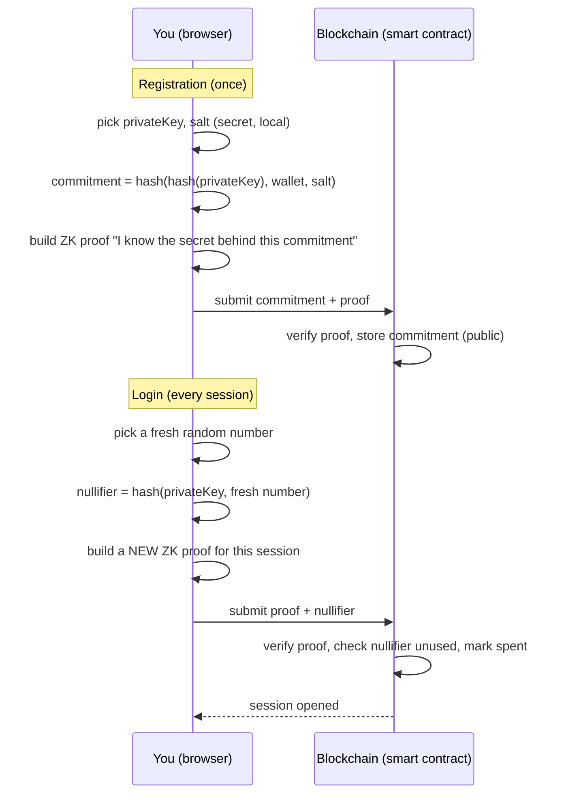

# zkCredentials, Explained for Someone Who Just Started CS

You're a few weeks into your first semester. You've written a `for` loop, you've heard the word
"algorithm" a lot, and someone just told you this project uses "zero-knowledge proofs" and
"zkSNARKs" and you nodded like that meant something. This document is the version of the talk
that assumes none of that — just curiosity, and the CS instinct to ask "wait, how does that
actually work?"

By the end, you'll understand the real system well enough to explain it to your roommate. No
cryptography background required. We'll build every idea from something you already understand.

---

## 1. The problem, in plain English

Say you're a student, and you want to log into a website using your crypto wallet instead of a
password (lots of apps let you do this now — "Connect Wallet" instead of "Sign In").

Here's the catch: a wallet address is just a long public number, like
`0x70997970C51812dc3A010C7d01b50e0d17dc79C8`. It's public *forever*. Every transaction that
address ever makes — every login, every purchase, every interaction — is sitting on a public
ledger that anyone on Earth can read, indexed by that same number, forever.

Imagine if every time you swiped a login badge, the swipe got printed on a public bulletin board
with your name on it, permanently, and anyone could later cross-reference all your badge swipes
to build a complete timeline of everywhere you'd ever logged in. That's a standard Web3 wallet
login. It works, but it's not private.

**The question this whole project asks:** can a student log in — prove "yes, I'm a legitimate,
registered user" — *without* that public bulletin-board effect? Can you prove you're allowed in,
without broadcasting your identity every single time?

That's what "zero-knowledge proof" login is trying to do. Let's build up the tools to understand
how, one idea at a time.

---

## 2. Building block #1: a function you can't run backwards

You already know functions: `f(x) = y`. Give it an input, get an output. Normal functions, you can
often work backwards — if you know `y = x + 5` and `y = 12`, you can figure out `x = 7`.

A **one-way function** (cryptographers call the ones we use **hash functions**) is different: it's
easy to compute forwards, but computationally infeasible to reverse. Given `x`, computing
`hash(x)` takes microseconds. Given `hash(x)`, finding the original `x` would take longer than the
age of the universe with all the computers on Earth working together — assuming `x` was
reasonably random and the hash function is well-designed.

Think of it like a **paper shredder that's also a photocopier**: you can feed a document in and get
a specific, deterministic pile of confetti out — the same document always makes the same exact
pile of confetti — but no reasonable amount of effort reassembles the original document from the
confetti.

Two properties we rely on constantly in this project:

- **One-wayness**: can't go from `hash(x)` back to `x`.
- **Determinism + collision resistance**: the same `x` always produces the same `hash(x)`, and two
  *different* inputs essentially never produce the same output.

The specific hash function this project uses is called **Poseidon**. There's a very good, very
practical reason it's Poseidon and not something more familiar like SHA-256 (the hash function
behind Bitcoin) — we'll get to why in section 6.

---

## 3. Building block #2: a locked box you can't peek into (yet)

Now here's a puzzle: suppose you want to "commit" to a number — lock in a choice — without
revealing what it is yet, in a way where you *can't change your mind later* and anyone can later
verify you didn't cheat.

This is exactly the "rock-paper-scissors over the phone" problem. If you and a friend play
rock-paper-scissors over a phone call, whoever says their move *second* can just lie and win every
time. The fix: the first player doesn't say "rock" — they say a locked-box version of "rock", the
second player says their real move, and *then* the first player reveals what was in the box, and
everyone can check it matches.

That "locked box" is called a **commitment**, and hash functions build it directly:

```
commitment = hash(secret_value)
```

Because hashing is one-way, publishing `commitment` doesn't reveal `secret_value`. But because
hashing is deterministic, anyone can later check "does `hash(secret_value) == commitment`?" and
catch you if you try to lie about what you committed to.

This project's login system registers a commitment on the blockchain when a student signs up.
The actual formula is a little more layered than a single hash (we'll see exactly why in a
moment), but the idea is identical to the rock-paper-scissors box: lock in a secret now, prove
things about it later, without ever revealing the secret itself.

---

## 4. Building block #3: proving you know a secret without saying it

This is the big one — the actual "zero-knowledge" part. Here's the classic way computer
scientists have explained this idea for decades, because it's just a genuinely great story:

> **Ali Baba's Cave.** Imagine a circular cave with a single entrance, and deep inside, the path
> splits into two branches — left and right — that reconnect at a secret door blocking a hidden
> passage between them. Only someone who knows the magic word can open that door.
>
> Peggy claims she knows the magic word. Victor doesn't believe her. Here's how Peggy proves it
> *without ever saying the magic word out loud*:
>
> 1. Victor waits outside. Peggy walks into the cave alone and picks either the left or right
>    branch — Victor can't see which.
> 2. Victor then walks to the entrance and shouts which branch he wants Peggy to come out of —
>    "left!" or "right!" — chosen at random, and *he* doesn't know which one she actually
>    entered.
> 3. If Peggy really knows the magic word, she can always come out the branch Victor asked for —
>    if she's on the wrong side, she just opens the secret door and walks through. If she doesn't
>    know the word, she's stuck on whichever side she happened to pick, and has a 50% chance of
>    guessing wrong and getting caught failing to appear from the requested branch.
> 4. Repeat this twenty times. If Peggy doesn't know the word, she'd need to get lucky twenty
>    times in a row — about a 1-in-a-million chance. If she succeeds every single time, Victor
>    becomes convinced, for all practical purposes, that she really does know the magic word.
>
> And notice: Victor never learns the magic word. He only learns "she can do the thing that
> requires knowing it." That's zero-knowledge — you prove a *fact* about a secret without
> revealing the secret.

Real zero-knowledge proof systems (like the one this project uses) don't literally involve caves,
obviously — they use serious math over cryptographic structures called **elliptic curves** — but
they capture exactly that same shape: repeated challenge-and-response that mathematically forces
a cheater's odds down to "essentially impossible," while a legitimate prover always succeeds,
without the verifier ever learning the underlying secret.

The specific proof system this project uses is called **Groth16**, and it's a member of a family
called **zk-SNARKs** ("zero-knowledge Succinct Non-interactive ARguments of Knowledge" — a
mouthful, but each word means something: *succinct* = the proof is tiny no matter how complex the
statement; *non-interactive* = unlike the cave story, there's no back-and-forth, you generate one
proof and hand it over; *argument of knowledge* = it convinces the verifier the prover actually
knows the secret, not just that a statement happens to be true).

---

## 5. Building block #4: a ticket stub that can't be reused

One more idea before we assemble everything. Suppose you generate a valid proof and submit it to
log in. What stops someone who's watching the network from just *copying* that exact proof and
submitting it again to open a second session pretending to be you?

The fix is the same one used at a concert: your ticket gets torn (or scanned and marked used) the
first time you walk in. A **nullifier** is a cryptographic version of the torn ticket stub: a value
computed from your secret plus a fresh, random, one-time-use number, and the system keeps a public
list of "nullifiers already spent." Try to reuse one, and it's already on the list — rejected.

```
nullifier = hash(your_secret, a_fresh_random_number_you_pick_this_time)
```

Because you pick a *new* random number every time you log in, you get a brand-new nullifier every
session — so an outside observer watching the list of spent nullifiers can't tell "these two
logins came from the same person" just by looking at the nullifier values themselves. (Keep that
last sentence in your back pocket — it becomes important, and slightly bittersweet, in section 7.)

---

## 6. Now let's put it together: how zkCredentials actually works

You now have all four pieces: **one-way hashing**, **commitments**, **zero-knowledge proofs**, and
**nullifiers**. Here's the actual system, in two phases.

### Phase 1: Registration (happens once)

1. Your browser generates two random secret numbers: a `privateKey` and a `salt`. These never
   leave your device.
2. Your browser computes a commitment:
   `commitment = hash(hash(privateKey), yourWalletAddress, salt)`.
   (Notice the *inner* hash — `hash(privateKey)` before it goes into the outer hash. That's
   deliberate: it means even someone who somehow learned your wallet address and salt still can't
   invert the outer hash and recover your raw `privateKey` — they'd only ever see its hashed
   image. It's an extra layer of the "paper shredder" from section 2, wrapped around itself.)
3. Your browser builds a zero-knowledge proof (the "Ali Baba's cave" trick, done for real, with
   math) that says: *"I know a `privateKey` and `salt` that hash together into this exact
   `commitment`, and I'm not going to tell you what they are."*
4. That commitment and proof get submitted to the blockchain. The smart contract checks the proof
   is valid, and — if so — stores the commitment publicly. Your raw secret key never touched the
   network.

### Phase 2: Login (happens every time you sign in)

1. Your browser decrypts your locally-stored secret (protected with a password-style encryption
   key derived from a quick wallet signature — think of this signature step like unlocking your
   phone with Face ID before it lets you into an app: a local proof of "it's really you sitting
   here," not a network event).
2. You pick a *fresh* random number and compute this session's `nullifier` (section 5).
3. Your browser generates a brand-new zero-knowledge proof: *"I know the secret behind a
   previously-registered commitment, and here's this session's one-time nullifier, correctly
   derived from that same secret."*
4. That proof gets submitted on-chain. The smart contract: (a) checks the proof is
   mathematically valid, (b) checks this exact nullifier hasn't been used before, (c) marks it
   used, and (d) opens you a session — you're logged in.

At no point does your raw secret key ever appear on the network, in a transaction, or in any log
anyone could read. That part is real, measured, and works.

Concretely, this circuit ("circuit" is just the cryptographer's word for "the specific
mathematical statement your zero-knowledge proof is proving") is genuinely small: it compiles down
to **1,698 constraints** — think of a "constraint" as roughly one equation the proof has to
satisfy — and generating a full proof takes somewhere between about **1 and 8 seconds** on
ordinary laptops and phones, entirely inside your browser, no server round-trip required.



---

## 7. Being honest: what this does *not* hide (and why that's a great lesson, not a failure)

Here's something a lot of intro material skips, and it's actually the most valuable lesson in the
whole project: **a system can achieve one specific security property perfectly while still not
achieving a different, related-sounding property.** Precision about exactly which is which is most
of what security research actually is.

**What's achieved: your secret key is never exposed.** This is real and measured. The private key
never leaves your browser, never appears in a transaction, and can't be recovered from the
commitment even by someone who can see everything on the blockchain.

**What's *not* achieved: hiding which wallet is doing the logging in.** Here's the catch — to
submit that proof to the blockchain at all, *something* has to send the transaction, and it gets
sent from your own wallet. Every blockchain transaction records who sent it (that's `msg.sender`,
in the code). So even though the proof itself reveals nothing about your secret key, the *fact
that your wallet submitted a transaction at all* is completely public, forever, from the very
first registration onward.

This is the difference between two properties that sound almost identical but are not:

- **"Key secrecy"** — nobody can learn your password. *(Achieved.)*
- **"Anonymity" / "unlinkability"** — nobody can tell it was *you* who logged in. *(Not achieved —
  your wallet address is visible every time, exactly like a name badge on a public bulletin
  board.)*

A system that actually wants both would need something called a **relayer** — a separate party
that submits the transaction *on your behalf*, so the blockchain only sees the relayer's address,
not yours (this trades one kind of trust problem for another: now you have to trust the relayer
not to censor you or misuse what it briefly sees). This project documents that gap and the fix
honestly, rather than quietly pretending the problem doesn't exist — which, in real security
research, is exactly the right instinct: know precisely what you built, and say so.

**One more honest gap, and it's a genuinely fun one to think about:** because the proof and its
one-time nullifier get sent as a normal, visible network message before they're confirmed, someone
watching the network *really fast* could theoretically copy your exact submission and get their
copy accepted first — using your proof to open a session that then gets falsely credited to
*their* wallet, not yours, since the system checks "did this exact nullifier get used" rather than
"did the original sender resubmit it." This is called a **front-running** attack (from the stock
market idea of jumping ahead of someone else's trade), and it's a known, documented weakness — not
something silently ignored, but a specific, named thing to fix in a future version. If you ever
build something like this yourself: check *who* is allowed to use a session, not just *whether* a
session exists.

---

## 8. A five-minute crash course on the blockchain part

You don't need to become a blockchain expert to understand this project, but here's the minimum
useful picture:

- A **smart contract** is just a program that lives on a blockchain instead of a normal server.
  Anyone can call its functions; its code and its data (like the list of registered commitments)
  are public and tamper-resistant — nobody, not even the people who wrote it, can secretly edit
  the stored data.
- This project's contracts are **upgradeable**, which sounds contradictory ("tamper-resistant but
  upgradeable"?) but isn't: the *data* is permanent and honest, while the *logic* can be swapped
  out later by an authorized administrator, the same way you can update an app on your phone
  without losing your saved data. This matters because bugs happen, and "we can never fix this,
  ever" is a bad property for a system still being actively developed.
- This project runs on **zkSync Era**, which is a "Layer 2" — a system built on top of Ethereum
  that batches many transactions together and proves (using its *own*, unrelated
  zero-knowledge-proof system) that the batch was processed correctly, before checking in with
  Ethereum. The practical upshot for you: transactions are dramatically cheaper — this project's
  login transaction costs a fraction of a cent on zkSync, versus something like eleven to fifty
  dollars for the *identical* operation on Ethereum directly, depending on network conditions.
  That's not a small optimization — it's the difference between "usable as a real login system"
  and "nobody would ever do this."

---

## 9. Why any of this should matter to you, three weeks into CS

You've now got hands-on intuition for four ideas that show up constantly in upper-level courses:

- **One-way functions** are the foundation of basically every password system, every digital
  signature, and every blockchain you'll ever encounter.
- **Zero-knowledge proofs** are one of the most genuinely surprising ideas computer science has
  ever produced — the fact that you can prove a statement is true while provably revealing *zero*
  additional information beyond its truth was considered borderline magical when it was first
  proven possible in the 1980s, and it now underlies real production systems (this one included).
- **Precise security claims** — the discipline of saying exactly what you achieved and exactly
  what you didn't, instead of a vague "it's secure" — is the actual skill that separates a working
  cryptosystem from a broken one that *sounded* fine. Notice: everything in section 7 was
  discovered and written down by the people who built this system, about their own system. That
  kind of self-scrutiny is a habit worth building early.
- **Distributed systems and cost/performance trade-offs** (why zkSync, why Groth16 instead of a
  bigger, slower proof system, why 1,698 constraints instead of 25,000) show up in almost every
  real engineering decision you'll ever make, blockchain or not: every design choice is a trade-off
  someone had to justify with actual numbers, not vibes.

If any part of this made you go "wait, how does the math for the zero-knowledge proof actually
work under the hood" — that curiosity is exactly what a cryptography or computer security elective
is for. You don't need to wait until senior year to start poking at this; the ideas here build
directly on discrete math and probability you'll see early in your CS courses.

---

## 10. Quick glossary

| Term | Plain-English meaning |
|---|---|
| Hash function | A one-way "shredder": easy to compute forward, practically impossible to reverse. |
| Commitment | A locked-box hash of a secret — lets you lock in a value now, prove it later. |
| Zero-knowledge proof | Proof that you know a secret, without revealing the secret itself. |
| Nullifier | A cryptographic "torn ticket stub" that stops the same proof from being reused. |
| zk-SNARK | A specific family of small, fast-to-verify zero-knowledge proofs (this project uses one called Groth16). |
| Smart contract | A program that runs on a blockchain instead of a normal server. |
| `msg.sender` | The wallet address that sent a given blockchain transaction — always public. |
| Relayer | A stand-in that submits a transaction on your behalf, so your own wallet address stays hidden from that specific transaction. |
| Front-running | Jumping ahead of someone else's pending transaction, using a copy of it, before theirs confirms. |
| Layer 2 (e.g. zkSync) | A system built on top of a blockchain like Ethereum that processes transactions more cheaply while still settling back to it for security. |

---

## 11. If you want to go further

- Try to explain Ali Baba's cave to a friend from memory, no notes. If you can, you actually
  understand zero-knowledge proofs at an intuitive level most people never reach.
- Look for an introductory cryptography or computer security course in your department's
  catalog — the ideas in section 4 and section 7 are exactly what those courses formalize with
  real math.
- If you're curious about the actual mathematics behind Groth16, elliptic curves, and how a
  "circuit" turns into a proof — that's genuinely graduate-level material, but the intuition you
  just built is the correct starting point. Nobody understands the full math on day one either.
- The real, full technical writeup this document is a simplified version of lives in this same
  repository's thesis and companion research paper, if you ever want to see exactly how far this
  intuition scales up into rigorous, cited, peer-reviewable detail.
