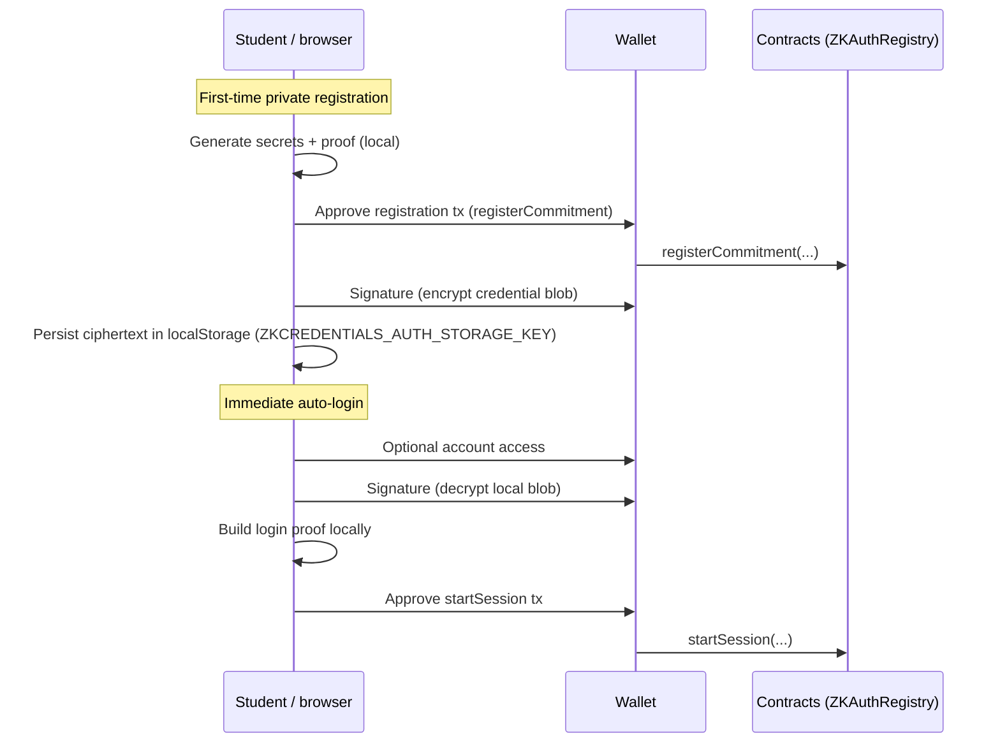
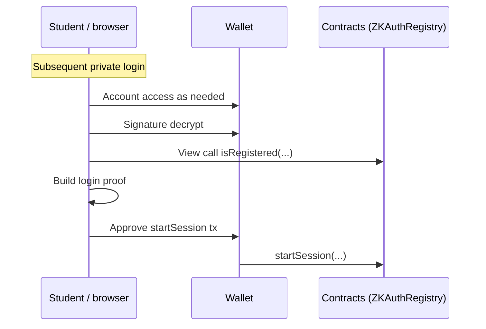

# Student private login (ZK / zkAuth)

This page describes what **private login** means for the **student** role: product-level expectations, wallet prompts, and how the React app maps to **`ZKAuthRegistry`** on-chain.

Related code:

- Role policy: [`useUnifiedAuth.ts`](../src/hooks/useUnifiedAuth.ts) (`getAllowedAuthMethods` → student defaults to **`zk`** with **`web3` fallback`)
- Unified UI wizard: [`UnifiedAuthFlow.tsx`](../src/components/UnifiedAuthFlow.tsx)
- Proof + session orchestration: [`useZKAuth.ts`](../src/hooks/useZKAuth.ts)
- Encrypted credential blob key: [`authStorage.ts`](../src/constants/authStorage.ts) (`ZKCREDENTIALS_AUTH_STORAGE_KEY`, same name Zustand uses for persistence in [`authStore.ts`](../src/store/authStore.ts))

---

## For students (plain language)

### What you get

- **Private login** is the recommended way for students to sign in when you care about keeping **authentication** oriented around a **cryptographic commitment** and **encrypted local credentials**, instead of relying on ordinary Web3 sign-in alone.
- Your **ZK materials** live in **browser storage**, encrypted with a wallet signature-derived key tied to **this** wallet address—other sites cannot decrypt them without that signature chain.
- You can still switch to **Web3 login** from the unified flow if you prefer; admins and universities are **Web3-only** by policy.

### What private login does *not* magically hide

Anything already **recorded on-chain** on the credential side (certificate hashes, student wallet on certificates, revocation flags, etc.) still follows blockchain visibility rules. zkAuth protects the **authentication story**—not all historical linkage of past on-chain credential data.

---

## First-time setup (student + private login)

Follow the hints in **`UnifiedAuthFlow`** (wallet steps are labeled explicitly in the UI). Expect roughly:

1. **Commitment registration transaction** — writes your zkAuth enrollment to **`ZKAuthRegistry`**.
2. **Signature** — used to encrypt and lock your local zk credentials to this wallet (`signMessage`).
3. **Auto-login immediately after signup** — another **signature** to decrypt credentials and a **transaction** to **`startSession`** on **`ZKAuthRegistry`**.

Exact counts can vary slightly by wallet and whether credentials already existed for this address (the wizard **skips re-registration** and goes straight to login when `zkAuth.hasCredentials` is already true).

---

## Coming back later (already registered)

1. Confirm the **same wallet** that encrypted your blob (the app aligns account access plus decryption signature with that expectation).
2. **Signature** to decrypt local ciphertext.
3. **Read-only check** (`isRegistered`) that the commitment is still valid after deploy/registry changes—the hook may prompt you to repair local state (`COMMITMENT_NOT_REGISTERED`).
4. **Local proof generation** — no blockchain until the tx.
5. **`startSession` transaction**.

---

## Technical notes for engineers

### Why students default to zk

[`getAllowedAuthMethods`](../src/hooks/useUnifiedAuth.ts): students allow **`['zk','web3']`** with **`default: 'zk'`** to steer privacy-preserving authentication while preserving a safety valve.

### Where registration chains into login

[`handleZKRegistration`](../src/components/UnifiedAuthFlow.tsx) awaits `zkAuth.register`, then unconditionally attempts `zkAuth.login` (mirrors **`/zkauth`** behavior). Errors such as **`CREDENTIALS_OUTDATED`** or **`COMMITMENT_NOT_REGISTERED`** leave the wizard on a corrective step rather than falsely marking completion.

### Local storage coupling

Persisted slice + zk envelope share **`ZKCREDENTIALS_AUTH_STORAGE_KEY`**. When the wallet switches account or disconnects, [`useAccountChangeHandler`](../src/hooks/useAccountChangeHandler.ts) removes this key alongside store reset—see unit tests asserting `localStorage.removeItem(ZKCREDENTIALS_AUTH_STORAGE_KEY)`.

### Manual full-stack rehearsal

Automated suites cover compile/test/Vitest. For a human-driven wallet pass (Hardhat/anvil-zksync + MetaMask + dev server), use the Quick Start sections in **[`README.md`](../../README.md)** and **[`CLAUDE.md`](../../CLAUDE.md)** at the repository root (paths may diverge across branches).
